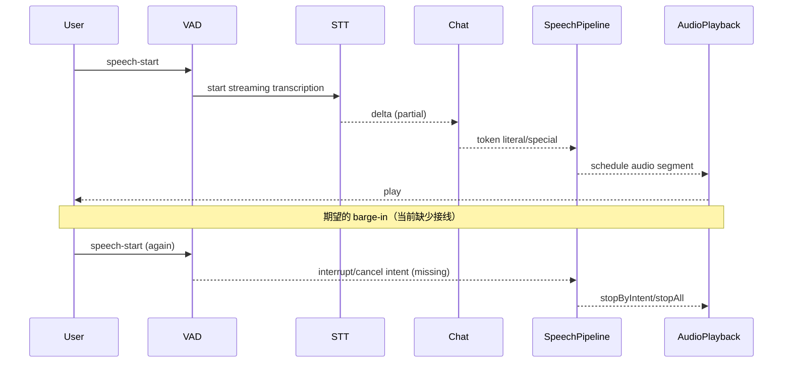

# 《AIRI 语音→文本→模型→文本→语音 全链路架构技术报告》

> 面向：AIRI（`moeru-ai/airi`）全仓“语音输入→即时对话→语音输出/嘴型联动”架构核对与差距定位
> 目标：把“输入到输出”每个环节的**职责边界、数据形态、触发条件、可插拔点、可中断点**梳理清楚，并对标 Neuro-sama 一类“即时反馈”体验找出结构性差距与优先改造点
> 生成时间：2026-01-13（本报告由代码扫描自动总结；建议结合你实际运行的 app 形态二次验证）

---

## 0. 你在跑的 AIRI：运行时与目录边界（Web / Desktop / Mobile）

### 0.1 三条“舞台”链路（stage）

- **Web 端**：`apps/stage-web`（浏览器运行，入口页面见 `apps/stage-web/src/pages/index.vue`）
- **桌面端**：`apps/stage-tamagotchi`（**Electron**，不是 Tauri；渲染进程页面见 `apps/stage-tamagotchi/src/renderer/pages/index.vue`）
- **移动端**：`apps/stage-pocket`（Capacitor/Vue；页面结构与 web 类似）

### 0.2 共享与平台特化：是否共享同一套 store/types/utils？

这三端的“语音链路”主干高度共享（关键在 `packages/stage-ui`）：

- **共享核心（强相关）**
  - **Provider 体系 / 配置与实例缓存**：`packages/stage-ui/src/stores/providers.ts`
  - **语音输入（Hearing）模块**：`packages/stage-ui/src/stores/modules/hearing.ts`
  - **VAD（模型）封装**：`packages/stage-ui/src/stores/ai/models/vad.ts`
  - **VAD Worklet + 管线管理**：`packages/stage-ui/src/workers/vad/*`、`packages/stage-ui/src/libs/audio/vad.ts`
  - **LLM 流式编排（Chat orchestrator）**：`packages/stage-ui/src/stores/chat.ts`
  - **TTS 分段/队列/可取消播放**：`packages/pipelines-audio/src/*` + `packages/stage-ui/src/services/speech/*`
  - **播放与嘴型（Live2D lip sync）**：`packages/stage-ui/src/components/scenes/Stage.vue`（WidgetStage 内部会注册 speech host 并处理播放/嘴型）

- **平台特化（主要在“权限/窗口/系统能力”层）**
  - **Desktop 权限/窗口行为**：`apps/stage-tamagotchi/src/renderer/components/...` 通过 Eventa 调 `electron.systemPreferences.getMediaAccessStatus`、窗口 click-through 等
  - **VAD Worklet 与 VAD Worker**：web/pocket 也有各自的 `apps/*/src/workers/vad/*`（通常是打包/worker url 层面的差异）；但 stage-ui 也自带一份 worklet/worker，可作为统一基线

### 0.3 “核心原语”是否绑定 UI？

现状结论：

- **好消息**：语音链路的大多数核心原语已抽象为可复用模块，而不是散落在 UI：
  - Input（Audio）侧：`useAudioDevice` / `useAudioRecorder` / VAD manager / `useHearingSpeechInputPipeline`
  - Provider（STT/TTS/Chat）侧：`useProvidersStore`（统一创建 + 校验 + runtime state）
  - Output（Speech）侧：`createSpeechPipeline` + `createPlaybackManager` + `speech runtime (BroadcastChannel + Eventa)`
- **仍然“偏 UI 的关键耦合点”**：
  - **VAD 事件 → 业务动作（启动 STT、提交 utterance、打断播报）**目前多写在页面层（`apps/*/pages/index.vue`）；
  - **语音对话的 turn-taking 状态机**并未作为独立 store/模块统一管理（更多是“页面 onSpeechStart/onSpeechEnd + chat ingest”）。

> 对标 Neuro-sama 的结构性差距很可能来自这里：即便底层有可取消/可队列的能力，但“抢占/中断”的**业务触发**没有收敛成统一的状态机与事件总线。

---

## 1. 配置与“可插拔 Provider”检查（决定整个链路怎么串）

### 1.1 Provider 总控：`useProvidersStore`（配置入口、实例缓存、能力描述）

核心文件：`packages/stage-ui/src/stores/providers.ts`

关键点：

- **配置存储（入口）**：`useLocalStorage('settings/credentials/providers', {})`
  - 每个 providerId 对应一份 config（API Key、Base URL、region、voice 等）
- **“已添加 provider”标记**：`useLocalStorage('settings/providers/added', {})`
- **实例缓存**：`providerInstanceCache`（按 `providerId` 缓存单例实例）
- **运行时状态**：`providerRuntimeState`（是否配置有效、models、voices、加载错误等）
- **Provider 元数据中心表**：`providerMetadata: Record<string, ProviderMetadata>`
  - category：`chat | embed | speech | transcription`
  - capabilities：`listModels / listVoices / loadModel`
  - validators：`validateProviderConfig`
  - transcriptionFeatures：`supportsGenerate / supportsStreamOutput / supportsStreamInput`

`getProviderInstance(providerId)` 是“调用边界”：

- 取出 `providerCredentials[providerId]`
- 通过 `providerMetadata[providerId].createProvider(config)` 创建实例
- 缓存并返回

> 这意味着：**Provider 是按 providerId 单例化的**。如果你想同类 provider 多实例（如同一实现不同 key/baseURL）目前不直接支持，需要引入“实例命名空间”或“profile 概念”（比如 `openai#primary` / `openai#fallback`）。

### 1.2 Provider 选择策略（配置入口在哪里？）

#### STT（Transcription / Hearing）

- **选择入口（本地持久化）**：`packages/stage-ui/src/stores/modules/hearing.ts`
  - `settings/hearing/active-provider`
  - `settings/hearing/active-model`
  - `settings/hearing/active-custom-model`

也就是说：STT 的“当前激活 provider/model”**属于 Hearing 模块**，而不是 providers store。

#### TTS（Speech）

- Speech 的 active provider/model/voice 在 speech store（并由 settings 页面配置），实际调用点在 Stage 场景中读取：
  - `packages/stage-ui/src/stores/modules/speech.ts`（生成 SSML、封装 speech 调用）
  - `packages/stage-ui/src/components/scenes/Stage.vue`（真正调用 `generateSpeech(...)` 并 decode/playback）

#### LLM（Chat）

- active provider/model 在 `packages/stage-ui/src/stores/modules/consciousness`（页面/场景取用）

### 1.3 是否支持“同类 provider 多实例”？

**默认不支持同类 provider 多实例**（同一 providerId 只有一份 config + 一个 cached instance）。

当前可行替代方案：

- 通过“多个 providerId（不同实现）”实现“多选”（例如 OpenAI / OpenAI-compatible / Aliyun NLS）
- 或者在 `providerMetadata` 层面定义多个“别名 providerId”，共享 createProvider 但不同 localStorage key（尚未看到现成机制）

### 1.4 Provider 调用边界与 schema 统一程度

#### STT 输入统一：File / Stream 两种形态

在 `useHearingStore.transcription(...)` 中：

- **Generate 模式**：要求 `File`（`audio/transcriptions`），可选 `response_format=json|verbose_json|text`
- **Stream 模式**：要求 provider 支持 `supportsStreamOutput`，并由特定 executor 实现（例：Aliyun NLS）
  - 支持 **Stream Input**：`ReadableStream<ArrayBuffer>`（音频 bytes stream，PCM16）

> 结论：STT 输入形态已经有“统一的上层协议”（File / Stream），但对不同 provider 的“更细 schema（timestamps/confidence/segments）”尚未统一成一个强类型输出契约。

#### TTS 输入：Text + voice + providerConfig

`Stage.vue` 中：

- `provider.speech(model, providerConfig)` + `@xsai/generate-speech`
  - 最终传入：`input`（text 或 SSML）、`voice`
  - 输出：`ArrayBuffer`（音频文件字节），随后 `audioContext.decodeAudioData(res)`

> 结论：TTS 的“内部调用抽象”趋向 OpenAI-compatible 风格（baseURL + Bearer + speech(...)），并可复用 `@xsai/generate-speech`；但音频流式输出目前主要靠“文本分段→多次 TTS”兜底。

### 1.5 失败与降级策略（策略是否存在？）

#### STT 失败 → 文本输入模式

- 结构上：chat 仍可通过 UI 文本输入继续对话（并不与 STT 强绑定）
- 但链路上：**没有看到“STT 失败自动切换到文本输入模式并保持会话状态”的明确策略模块**
  - 现状更像：STT 报错（console）+ UI 层仍可手动输入

#### TTS 失败 → 仅文本输出 + 主循环不阻塞

该策略**较完整**：

- `createSpeechPipeline` 对 `options.tts(...)` 的异常做 `try/catch`，失败会 `continue`，不会卡死整个 intent
- `Stage.vue` 当未配置 provider/voice 时返回 `null`，pipeline 会跳过该 segment

#### 错误上下文（sessionId/turnId/provider/params 摘要）

现状：

- provider 创建失败有 `console.error(...)` 但上下文不足（缺 turn/trace）
- hearing/transcription & chat 侧也主要是 console error，缺统一结构化字段

> 结论：**缺“端到端 trace 结构”**，会让性能/体验瓶颈难以定位（这在对标 Neuro-sama 的调优阶段是硬伤）。

---

## 2. 语音输入侧：麦克风 → AudioInput（可被 STT 消化）

### 2.1 采集层（Audio Capture）

#### Web（stage-web / stage-pocket）

麦克风采集基于 VueUse：

- `packages/stage-ui/src/stores/audio.ts` 的 `useAudioDevice()`：
  - `useDevicesList({ constraints: { audio: true } ... })` 枚举设备
  - `useUserMedia({ constraints: deviceConstraints, enabled: false, autoSwitch: true })` 获取 MediaStream
  - constraints 默认启用：`autoGainControl/echoCancellation/noiseSuppression`

#### Desktop（stage-tamagotchi / Electron）

仍然是前端 `getUserMedia` 形态（通过 VueUse `useUserMedia`），只是多了权限状态检查/提示：

- `apps/stage-tamagotchi/.../controls-island-hearing-config.vue` 使用 Eventa 调 Electron：`electron.systemPreferences.getMediaAccessStatus(['microphone'])`

> 结论：Desktop 并没有把音频采集放到 Rust/Tauri/系统 API 再注入前端；仍然是“渲染进程 WebAudio/MediaStream”路线。

### 2.2 设备选择：枚举、默认策略、热插拔

- 枚举：`useDevicesList`（`audioInputs`）
- 默认：优先 `deviceId === 'default'`，否则选第一个
- 热插拔：`useUserMedia(... autoSwitch: true)` + watch `audioInputs` 自动补全 selection

缺项（对标 checklist）：

- 没看到明确的“设备热插拔事件可观测/重连策略”抽象（主要依赖 VueUse 内部实现）

### 2.3 音频格式与缓冲策略（快反应结构基础）

#### 2.3.1 VAD Worklet：统一 16kHz / 512-sample frame（约 32ms）+ DC blocker

核心实现：`packages/stage-ui/src/workers/vad/process.worklet.ts`

- 固定目标采样率：`TARGET_SAMPLE_RATE = 16000`
- 固定帧长：`TARGET_CHUNK_SIZE = 512`
- 处理逻辑：
  - 对 AudioWorklet 输入的原始 `Float32` PCM 做**重采样**到 16k（含常见 48k→16k 的 box-filter decimate）
  - 做 DC blocker（减少低频嗡声/电流噪音）
  - `port.postMessage({ buffer: out })` 把每帧 Float32 送回主线程

意义（对快反应很关键）：

- **把“采样率/分帧”从链路早期就锁死**，避免 STT/VAD 因输入采样率漂移导致的不稳定
- 512-sample 作为最小处理单元，给后续事件化（speech_start/speech_end）提供更高时间分辨率

#### 2.3.2 “录音”与“流式 STT 输入”的缓冲策略

这里存在两条并行策略：

1) **录音（非流式 STT）**：`packages/stage-ui/src/composables/audio/audio-recorder.ts`

- 建立 AudioContext + AudioWorkletNode
- `node.port.onmessage` 收集 `Float32Array` chunks 到内存数组（`chunks.value.push(buf.slice(0))`）
- 停止时再封装成音频文件（供 `transcribeForRecording` 走 `File` 模式 STT）

2) **流式 STT 输入（Stream Input）**：`packages/stage-ui/src/stores/modules/hearing.ts` 的 `createAudioStreamFromMediaStream(...)`

- 建立 AudioContext（默认 16k + interactive）
- `workletNode.port.onmessage` 接收 `Float32Array` frame
- 转成 **PCM16**：`float32ToInt16(...)`
- 通过 `ReadableStream<ArrayBuffer>` 持续 `enqueue(pcm16.buffer.slice(0))`

这满足 checklist 的“分帧 + 队列/流式”要求：不会等“攒很大一块音频”才进入 STT。

#### 2.3.3 数据形态总结（AudioInput 的事实标准）

| 环节 | 数据形态 | 采样率/通道 | 备注 |
|---|---|---|---|
| Worklet 输出（给 VAD/录音/streaming STT 前置） | `Float32Array` | 16kHz / mono | 512 samples/frame |
| streaming STT 输入 | `ReadableStream<ArrayBuffer>`（PCM16 bytes） | 16kHz / mono | 由 `float32ToInt16` 转换 |
| generate STT 输入 | `File`（例如 `recording.wav`） | 不固定 | 取决于录音封装方式（需确认 blob 编码细节） |

### 2.4 安全上下文与工作线程

#### 2.4.1 AudioWorklet 的环境要求

- AudioWorklet 通常要求较新的浏览器能力；在某些 WebView/非安全上下文环境可能受限
- 现状：链路中 **大量依赖 AudioWorklet**（VAD、录音 tap、streaming STT 的输入流）

已存在的兜底（部分）：

- `packages/stage-pages/src/pages/settings/modules/hearing.vue` 提供了“非模型 VAD”的兜底：用 `AnalyserNode` 的音量阈值做 speaking detection
  - 但这只是“是否在说话”的兜底，不等价于“可供 STT 消化的分帧输入”

#### 2.4.2 计算密集型模块是否离开 UI 线程？

- **VAD 模型推理**：走 worker（`packages/stage-ui/src/workers/vad/vad.ts`；由 `useVAD` 初始化并通过 `createVADStates` 喂入帧）
- **分帧/重采样**：在 AudioWorklet 执行（实时音频线程，避免阻塞 UI）
- **STT 流式网络 IO**：在主线程通过 Fetch/ReadableStream（可进一步考虑放 Worker）

---

## 3. Turn-taking：连续语音 → utterance（快反应核心）

### 3.1 VAD 的角色边界与事件形态

基础事件定义：`packages/stage-ui/src/libs/audio/vad.ts`

- `speech-start`
- `speech-end`
- `speech-ready`（携带一段 buffer 与 duration；更像 “utterance ready for batch STT”）
- `debug`（包含 probability）
- `status`

对外封装：`packages/stage-ui/src/stores/ai/models/vad.ts` 的 `useVAD(...)`

- 内置阈值策略：`speechThreshold`、`exitThreshold = threshold * 0.3`、`minSilenceDurationMs = 400`
- 把 VAD 事件回调到 `options.onSpeechStart/onSpeechEnd`

### 3.2 End-of-utterance（终止判定策略）

现状：

- VAD 配置里有 `minSilenceDurationMs`，属于“静音阈值 + 最短静音时长”的一部分
- 但 “最短语音长度 / 最大等待时长 / 以及可配置化暴露程度”：
  - `useVAD` 默认写死了 `minSilenceDurationMs: 400`（未见统一 settings 暴露；settings 页面里确实有阈值 slider）
  - 在 streaming STT 场景（见下）**utterance 边界并不是由 VAD speech-end 来关停**，而是靠 idle timer

### 3.3 VAD 与 STT 的耦合方式（batch vs streaming）

在实际 stage 页面中存在两种模式（以 `apps/stage-web/src/pages/index.vue` 为例）：

- **Streaming STT（首选，若 provider 支持 stream input）**
  - speech-start：调用 `transcribeForMediaStream(stream, { onSentenceEnd })`
  - speech-end：**不停止 session**（注释写明交给 idle timer）
  - 结果：`onSentenceEnd(delta)` 目前直接把 `delta` 当成“可提交文本”并 `chatStore.ingest(delta)`

- **Batch STT（录音）**
  - speech-start：`startRecord()`
  - speech-end：`stopRecord()` → `onStopRecord(recording)` → `transcribeForRecording(recording)` → `ingest(text)`

#### 关键结构性问题：streaming STT 的 utterance 边界不受 VAD 驱动

`packages/stage-ui/src/stores/modules/hearing.ts` 里直接写了 TODO：

- `// TODO: integrate VAD-driven silence detection to stop and restart realtime sessions based on silence thresholds.`

这意味着：

- 目前 streaming STT 侧更像“长连接/长 session”，由 `idleTimeoutMs`（默认 15s）来关停
- 在“用户一段话结束后马上 commit”与“用户连续说话的分句 partial”之间，缺一个明确的 commit 策略层

### 3.4 barge-in（边说边打断）：结构能力 vs 业务接线

输出侧具备“可打断”的结构能力（详见第 7 节）：

- `createSpeechPipeline` 支持 `cancelIntent/interrupt/stopAll`
- `playbackManager` 支持 `AbortSignal` 中止当前 `AudioBufferSourceNode`
- `speech runtime` 支持跨窗口发 `cancel`（BroadcastChannel）

但输入侧（VAD speech-start）目前**没有默认触发**：

- 未看到在 `handleSpeechStart()` 中调用“停止播放 + 取消 LLM 生成/队列”的逻辑
- 现状更像：用户说话与助手播报可以并行发生（除非 UI 的其它 hook 刚好 stopAll）

> 对标 Neuro-sama：**barge-in 是最优先的结构点**。你现在“有刹车系统（可取消播放/intent）”，但“刹车踏板（speech-start 触发）”还没接上。

### 3.5 Push-to-talk 模式

现状：

- 主要是自动 VAD 触发录音/转写
- 未看到成体系的 Push-to-talk 状态机（可能存在 UI 控件，但不在语音链路主干抽象里）

---

## 4. STT（ASR）：转写不仅是“产出文本”，更是“产出可用事件流”

### 4.1 STT 执行位置（浏览器侧 vs 服务端/代理）

从 stage 链路的实现来看，STT 更偏“**浏览器采音 + 网络 provider 转写**”：

- **Generate 模式（文件上传）**：`useHearingStore.transcription(...)`
  - 标准路径：`@xsai/generate-transcription`（json/verbose_json）
  - 特例：`response_format=text` 会在 `useHearingStore.transcription` 内手动构造 `multipart/form-data` 并调用 `${baseURL}audio/transcriptions`
- **Streaming 模式（音频 stream）**：
  - `packages/stage-ui/src/stores/providers/aliyun/stream-transcription.ts`（Aliyun NLS）
  - 输入：`ReadableStream<ArrayBuffer>`（来自 `createAudioStreamFromMediaStream` 输出的 PCM16）
  - 输出：`textStream`（delta）与 `fullStream`（结构化 delta）

仓库里也能看到“浏览器侧 ASR（transformers pipeline）”的 worker（例如 `packages/stage-ui/src/libs/workers/worker.ts`），但它更像实验/备用路径；stage 入口页面默认链路未明显接入。

### 4.2 STT 输出形态（partial vs final）

在 `useHearingSpeechInputPipeline.transcribeForMediaStream(...)`：

- 如果 `result.mode === 'stream' && result.textStream`：
  - 每个 `value`（delta）会触发 `onSentenceEnd(value)`（命名上像“句末”，但语义实际是“增量”）
  - reader 结束时触发 `onSpeechEnd(fullText)`

在 stage 页面中（`apps/stage-web/src/pages/index.vue`、`apps/stage-tamagotchi/src/renderer/pages/index.vue`）：

- `onSentenceEnd(delta)` 目前直接 `chatStore.ingest(delta, ...)`

这会把“partial transcript”当成“可提交 turn”，可能导致：

- LLM 被过于频繁触发（碎片输入）
- 用户体验变差（助手频繁打断自己或不断开启新轮）

### 4.3 预处理策略（提升对话可用性）

未发现一个明确的、独立的 STT 后处理模块（标点恢复、数字单位规范化、填充词处理、多语言策略等）。目前更像“原样进入 chat ingest”。

---

## 5. 从“转写文本”到“对话输入”（InputProcessor 的真实工作）

### 5.1 Turn 结构化与元数据承接

现状里 voice 的来源信息没有统一入模：

- voice 转写文本最终进入：`useChatOrchestratorStore.ingest(text, { model, chatProvider })`
- chat 侧会构造 `streamingMessageContext`，但其中的 `input` 默认是 `input:text`（语音来源没有标准化类型/字段）

建议的目标数据结构（建议，不是现有代码）：

```ts
interface TurnInput {
  turnId: string
  sessionId: string
  source: 'mic' | 'text' | 'discord' | 'plugin'
  createdAt: number
  raw: {
    audio?: { sampleRate: 16000, pcm16Frames?: ArrayBuffer[] }
    stt?: { providerId: string, model: string, text: string, segments?: any, confidence?: number }
  }
  normalized: {
    text: string
    language?: string
  }
  trace: {
    providerIds: { vad?: string, stt?: string, llm?: string, tts?: string }
  }
}
```

### 5.2 会话状态机与可取消点

chat 侧已有较强的“可取消/防 stale”机制：

- `sessionId` + `generation`（`shouldAbort()` 检测 generation）
- `useChatMaintenanceStore.cleanupMessages()` 会取消 pending sends 并 reset stream

speech 侧也有可取消机制：

- intent 级别 cancel/interrupt/replace
- playback stopByIntent/stopAll

但目前缺少一个统一的“状态机 store”把它们串成：

- listening → processing → speaking
- 以及 speech-start 触发 barge-in 的策略

---

## 6. LLM 处理：输出不仅是文本，还要驱动“说话行为”

### 6.1 Prompt 组装与 context 注入

`packages/stage-ui/src/stores/chat.ts` 会把 `chatContext.getContextsSnapshot()` 注入到 message 列表中（system 之后插入一条 user 内容作为上下文块），属于“processor 注入”的早期形态。

### 6.2 流式输出贯穿到 TTS（结构已具备）

链路：`llmStore.stream(text-delta)` → `useLlmmarkerParser` → chat hooks（token literal/special）→ `Stage.vue` 写入 speech intent → `createSpeechPipeline` → chunker → TTS → playback

关键注意点：

- `useLlmmarkerParser` 的 `minLiteralEmitLength: 24` 会延迟第一段语音进入 pipeline（可能影响“即时反馈感”）
- `createStreamingCategorizer` 会过滤 `<think>/<reasoning>` 等 tag（不送入 TTS），这是正确的体验策略

### 6.3 用户再次开口时：LLM 生成是否可 cancel？

结构上可行（generation + cleanup），但当前 stage 页面里的 `handleSpeechStart()` 没有把 speech-start 绑定到 chat cancel。

---

## 7. 输出侧：从“LLM 文本”到“可播放语音 + 可驱动嘴型的信号”

### 7.1 OutputProcessor 关键模块清单

- **标签过滤（think/reasoning 不读）**：`packages/stage-ui/src/composables/response-categoriser.ts`
- **speech intent 总线（跨窗口）**：`packages/stage-ui/src/services/speech/bus.ts`
- **speech runtime（host/remote）**：`packages/stage-ui/src/services/speech/pipeline-runtime.ts`
- **speech pipeline（分段→TTS→播放队列）**：`packages/pipelines-audio/src/speech-pipeline.ts`
- **TTS 分段器（chunker）**：`packages/pipelines-audio/src/processors/tts-chunker.ts`
- **播放与嘴型驱动**：`packages/stage-ui/src/components/scenes/Stage.vue`

### 7.2 队列与仲裁（插队/抢占）

`createSpeechPipeline` 已支持：

- `behavior: queue | interrupt | replace`
- 以 priority 决定是否允许 interrupt（新 intent priority >= 当前 intent priority）

但 stage 目前对 chat intent 使用的是：

- `behavior: 'queue'`

要实现“高优先级系统告警/用户打断/短 ack 插队”，需要上层主动选择 `interrupt/replace` 与 priority。

### 7.3 “先短后长”策略是否存在？

现状：没有看到一个明确实现该策略的模块；但具备实现它的必要基础能力（streaming + chunker + intent priority）。

---

## 8. TTS：接口兼容性、音频格式与播放对齐

### 8.1 参数映射（model / voice / speed / response_format）

以 Stage 的调用为准：

- model：`activeSpeechModel`
- voice：`activeSpeechVoice.id`
- speed/pitch/volume：通过 `providerConfig`（由 providers store 的 config 返回 + UI 额外字段）参与 SSML 或 provider 参数

### 8.2 音频格式与播放

- 返回：`ArrayBuffer`
- 解码：`audioContext.decodeAudioData(res)` → `AudioBuffer`
- 播放：`AudioBufferSourceNode.start(0)`

缺项（对标 checklist）：

- “流式音频 chunk 级播放”未见（但文本分段多次 TTS 可以近似）

---

## 9. 播放与嘴型/表情联动

### 9.1 播放控制（用于 barge-in）

`Stage.vue` 的 `play(item, signal)` 在 `signal.aborted` 时会 `source.stop()`，并且 playback manager 支持 stopAll/stopByIntent/stopByOwner。

### 9.2 Lipsync

- Live2D：通过 `@proj-airi/model-driver-lipsync` 的 node 分析音频并驱动 `mouthOpenSize`
- speaking 状态与 mouthOpenSize 在 playback start/end 时更新

---

## 10. 全链路可观测性与定位能力

### 10.1 turnID/trace 的现状

目前是多套局部 ID 并存：

- chat：sessionId + generation
- speech：intentId/streamId/segmentId
- VAD/STT：无统一 turnID

建议：引入统一 `turnId` 并贯穿所有事件与请求，形成端到端 trace。

### 10.2 回放/导出能力

目前未见“导出一次对话的关键产物”能力；建议把以下产物按 turn 存档：

- 音频片段（PCM16 frames / wav）
- VAD 事件时间线
- STT 输出（partial/final + 置信度/segments）
- 最终 prompt（composed messages）
- TTS 分段（chunker reason）
- playback timeline（start/end/interrupt）

---

## Mermaid：全链路可视化（可编译）

### A) 全链路总览（输入→输出）

```mermaid
flowchart LR
  subgraph Runtime[Runtime / Apps]
    WEB[apps/stage-web]
    DESKTOP[apps/stage-tamagotchi (Electron)]
    POCKET[apps/stage-pocket]
  end

  subgraph Input[Input: Mic -> Audio Frames]
    DEV[useAudioDevice\nMediaStream + device selection]
    WORKLET[AudioWorklet\nprocess.worklet.ts\nresample->16k + 512 frames]
    VAD[VAD model\nspeech-start/end]
  end

  subgraph STT[STT / Hearing]
    PIPE[useHearingSpeechInputPipeline]
    STREAM_IN[ReadableStream<ArrayBuffer>\nPCM16 @16k]
    STT_PROV[Transcription provider\n(generate/stream)]
    TEXT[text / delta]
  end

  subgraph LLM[LLM / Chat]
    INGEST[chatStore.ingest]
    STREAM[llmStore.stream\ntext-delta]
    PARSER[llm-marker parser\nminLiteralEmitLength=24]
    HOOKS[chat hooks\nonTokenLiteral/onSpecial]
  end

  subgraph Output[Output: Speech + Playback + Lipsync]
    BUS[speech bus\nBroadcastChannel]
    RUNTIME_SPEECH[speech runtime\nhost/remote]
    SP[createSpeechPipeline\nintent/priority/interrupt]
    CHUNK[tts-chunker\nboost/hard/flush/special]
    TTS[TTS provider\n@xsai/generate-speech]
    PLAY[playback manager\nAbortSignal stop]
    LIP[lipsync\nmouthOpenSize]
  end

  WEB --> DEV
  DESKTOP --> DEV
  POCKET --> DEV

  DEV --> WORKLET --> VAD
  VAD --> PIPE
  PIPE --> STREAM_IN --> STT_PROV --> TEXT --> INGEST --> STREAM --> PARSER --> HOOKS --> BUS --> RUNTIME_SPEECH --> SP --> CHUNK --> TTS --> PLAY --> LIP
```

### B) “即时反馈”关键路径（含可中断点）



---

## 对标 Neuro-sama：优先核对的三类结构点（最终结论）

1) **Turn-taking 事件化且可抢占（barge-in）**
   - 结构能力：已具备（speech intent 可 cancel，playback 可 stop）
   - 缺口：speech-start 尚未成为统一打断信号源（缺状态机与接线）

2) **LLM→TTS “先短后长”与队列仲裁**
   - 结构能力：已具备（streaming + chunker + intent priority/behavior）
   - 缺口：缺显式策略模块；且 `minLiteralEmitLength=24` 可能拖慢首句

3) **真正分层（Input/Provider/Processor/Output）+ 可观测性**
   - 结构雏形：已具备（providers/hearing/chat/speech pipeline 清晰）
   - 缺口：缺统一 turnID/trace、缺可回放导出、缺结构化错误上下文

---

## 建议的下一步落地（按优先级）

1) **默认启用 barge-in**：VAD speech-start → stop playback + cancel chat generation + 重置/切换状态
2) **让 streaming STT 的 commit 由 VAD/静音策略驱动**：delta 用于字幕，final 才 ingest（或加 debounce/稳定窗口）
3) **降低 `minLiteralEmitLength` 或引入“更早 flush”机制**，并补一个“先短 ack intent”策略层
4) **统一 turnID/trace + 结构化日志 + 回放导出**：把一次对话的关键产物可复盘化
